# Presets

Ready-made C# color settings for VS Code, generated by the tool from Visual Studio 2026's Dark and Light
themes. See [Ready-made settings](../README.md#ready-made-settings) for how to use them and
[Regenerating the presets](../README.md#regenerating-the-presets) for how they are made. Each preview shows
the same part of [`sample/Sample.cs`](../sample/Sample.cs): on the left in the VS Code theme as it is, on the
right with the preset.

## Visual Studio's own colors

[`visual-studio-2026.json`](visual-studio-2026.json): C# exactly as in Visual Studio 2026, for VS Code's Dark 2026
and Light 2026 themes.

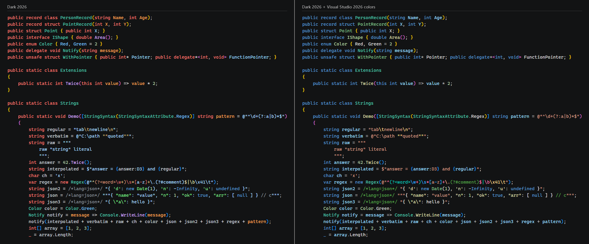

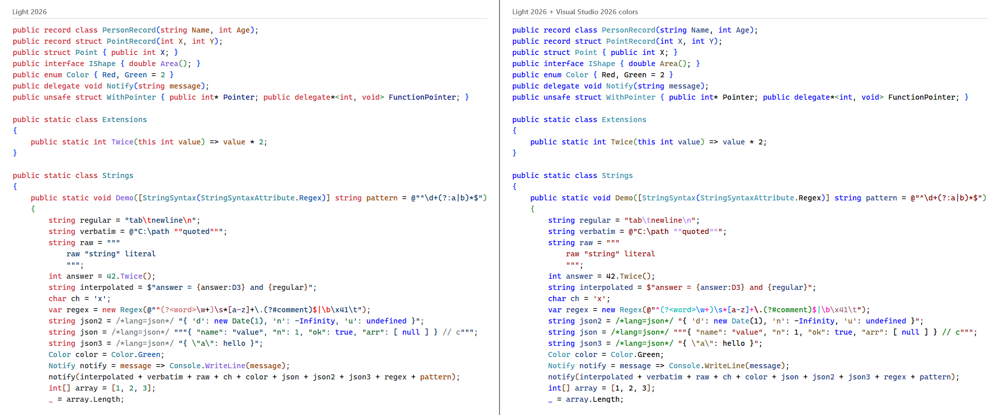

## Adapted to dark themes

Visual Studio Dark's colors adapted to each theme: the theme's own colors, plus colors that fit it where Visual
Studio tells apart what the theme doesn't.

### Dark Modern

[`adapted/dark-modern.json`](adapted/dark-modern.json)

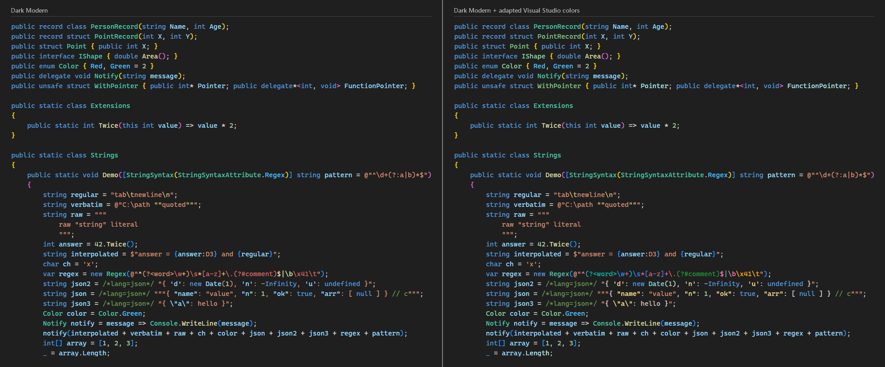

### Dark+

[`adapted/dark-plus.json`](adapted/dark-plus.json)

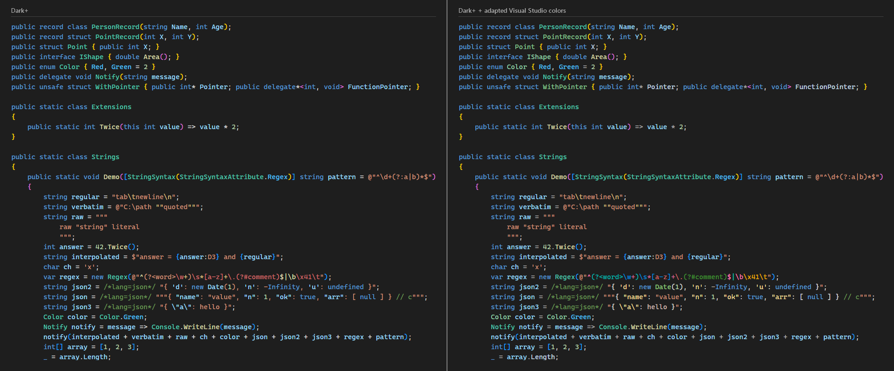

### Dark 2026

[`adapted/dark-2026.json`](adapted/dark-2026.json)

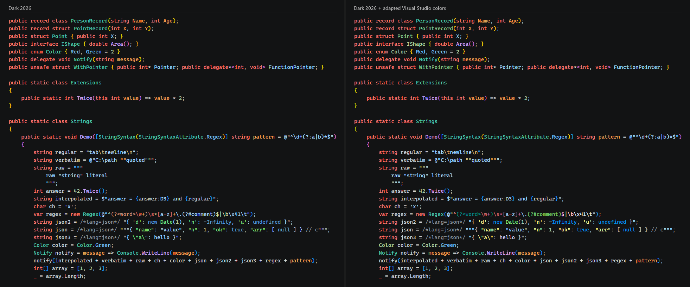

### Visual Studio Dark

[`adapted/visual-studio-dark.json`](adapted/visual-studio-dark.json)

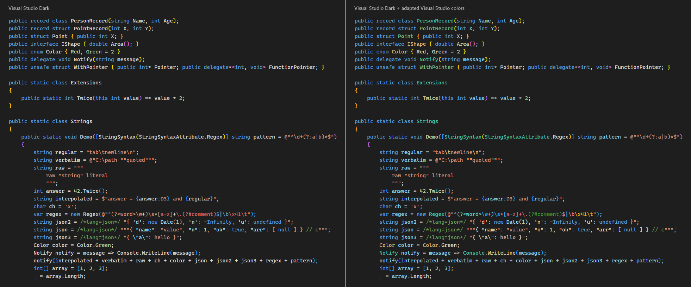

### Monokai

[`adapted/monokai.json`](adapted/monokai.json)

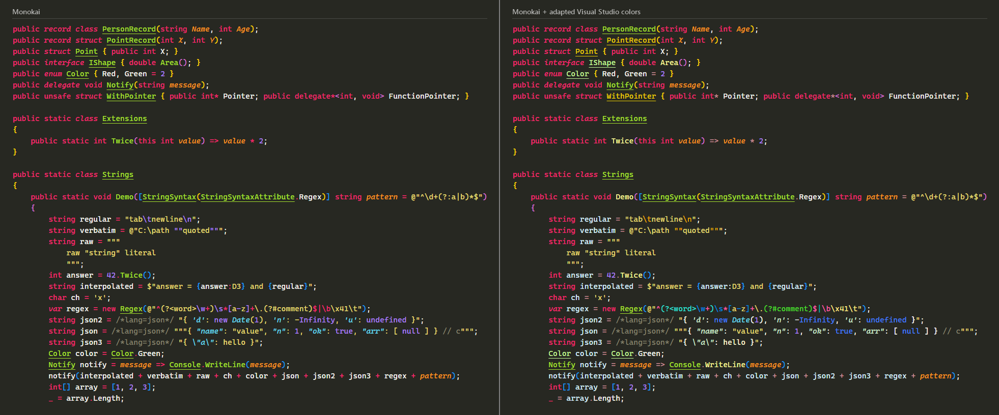

### Monokai Dimmed

[`adapted/monokai-dimmed.json`](adapted/monokai-dimmed.json)

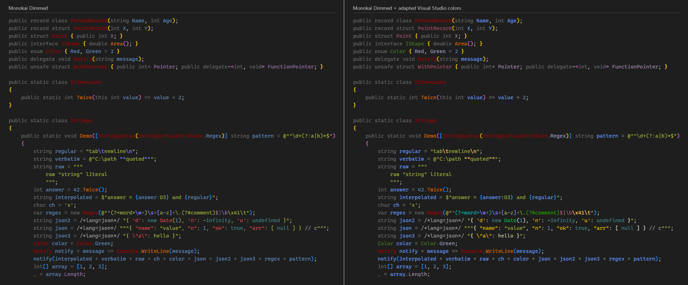

### Solarized Dark

[`adapted/solarized-dark.json`](adapted/solarized-dark.json)

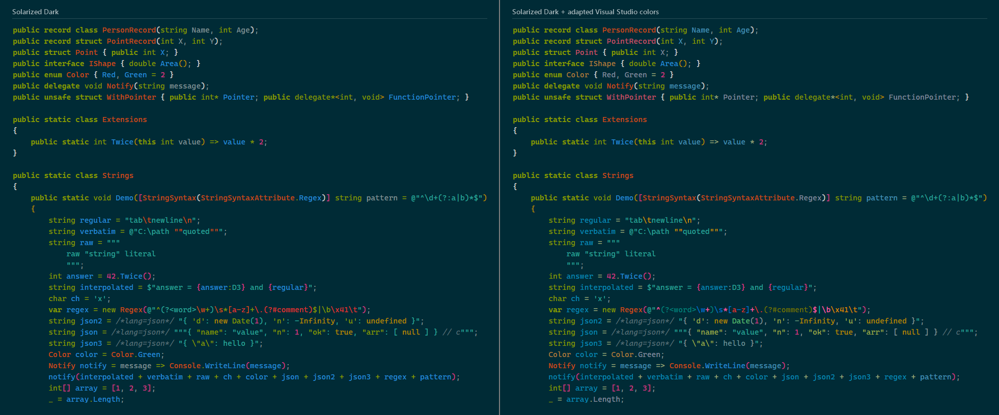

### Abyss

[`adapted/abyss.json`](adapted/abyss.json)

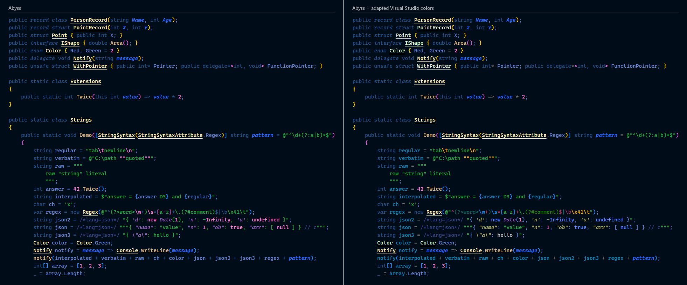

### Kimbie Dark

[`adapted/kimbie-dark.json`](adapted/kimbie-dark.json)

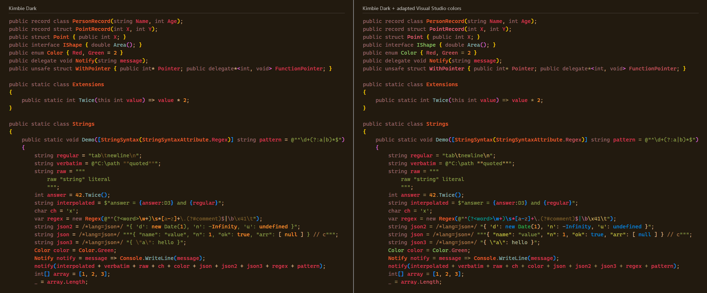

### Red

[`adapted/red.json`](adapted/red.json)

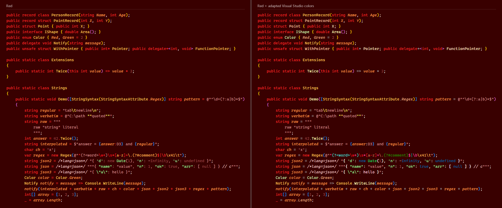

### Tomorrow Night Blue

[`adapted/tomorrow-night-blue.json`](adapted/tomorrow-night-blue.json)

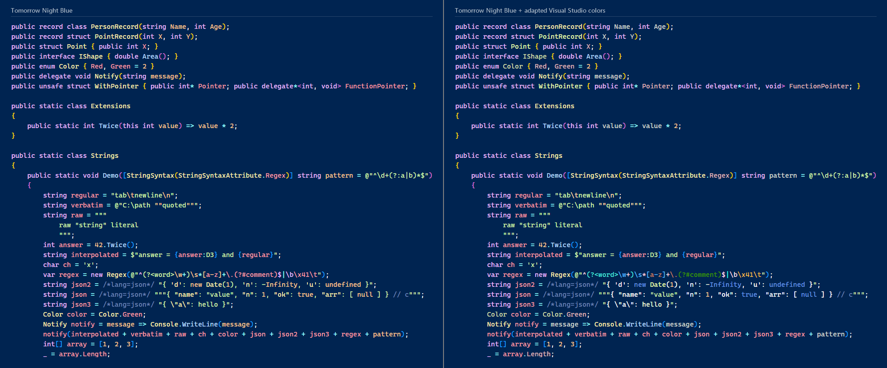

## Adapted to light themes

Visual Studio Light's colors adapted to each theme.

### Light Modern

[`adapted/light-modern.json`](adapted/light-modern.json)

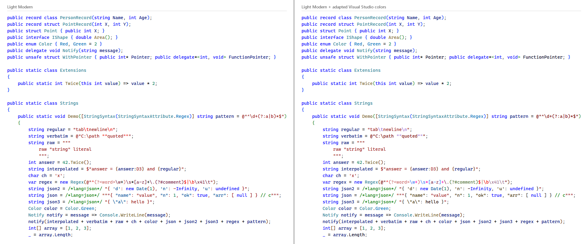

### Light+

[`adapted/light-plus.json`](adapted/light-plus.json)

### Light 2026

[`adapted/light-2026.json`](adapted/light-2026.json)

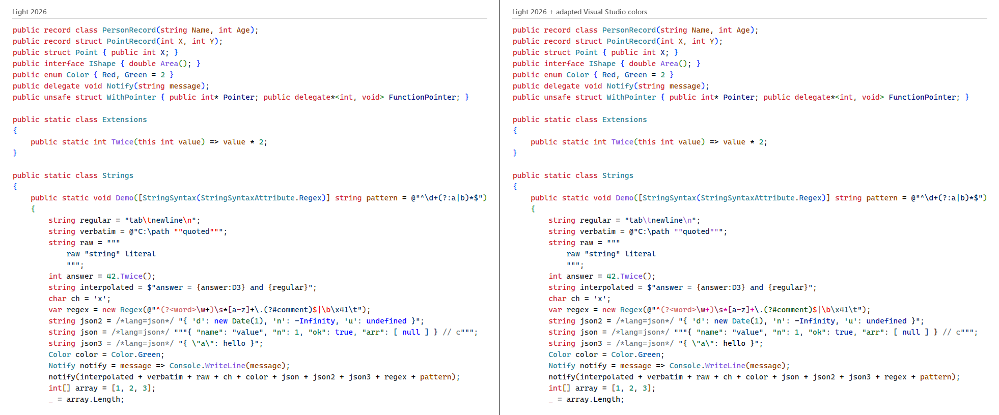

### Visual Studio Light

[`adapted/visual-studio-light.json`](adapted/visual-studio-light.json)

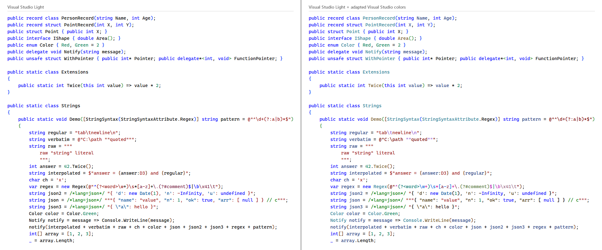

### Solarized Light

[`adapted/solarized-light.json`](adapted/solarized-light.json)

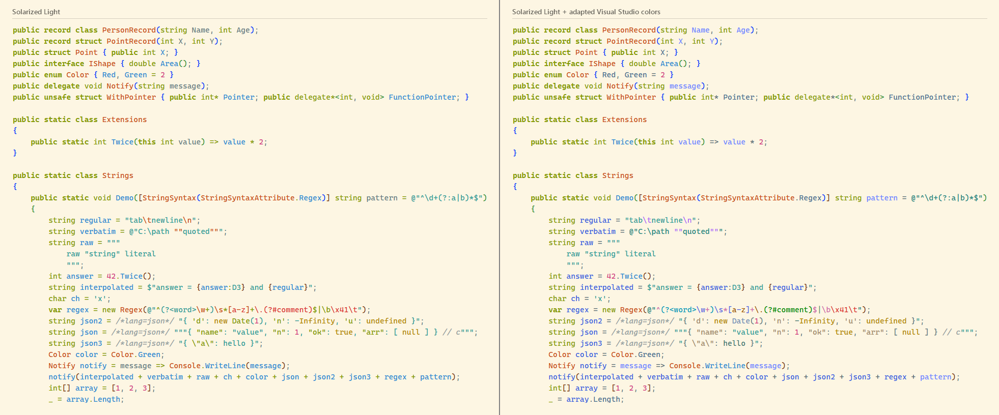

### Quiet Light

[`adapted/quiet-light.json`](adapted/quiet-light.json)

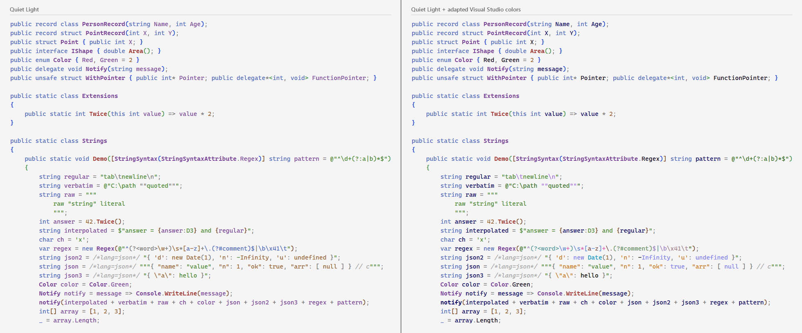
